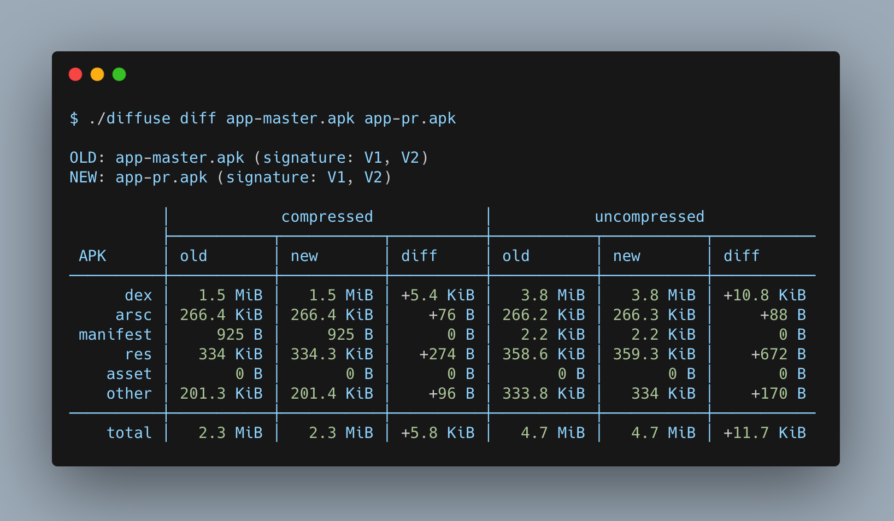

# Android Diffuse Example

Diffuse provides a high-level view of what has changed when comparing two APKs. This repository is an example of using the Diffuse tool against the APK of master branch compared with the APK of a pull request using GitHub Actions.



<br>

## Example

This repository is an example of using the Diffuse tool. In the master branch, an empty Android project has been initialized. In the pull request, a new library ([Timber](https://github.com/JakeWharton/timber)) is being added. The Diffuse tool outputs the changes of the APKs before and after adding the library.

To learn more about Diffuse, visit [Diffuse on GitHub](https://github.com/JakeWharton/diffuse)

<br>

## Diffuse Tool

The Diffuse tool is useful to track the changes in the APK during the development cycle. When new changes are constantly being merged, Diffuse can easily be integrated as a job to check for any issues in the continuous integration pipeline flow

Diffuse provides insights on:
- Sizes that make up an APK (dex, arsc, manifest, res, asset, other)
- Count of strings, types, classes, methods and fields
- Details of types, classes, methods and fields
- Size of assets
- Possible APK lint warning

<br>

## Usage

The current workflow set up for this project is to use the Diffuse tool on every pull request to compare the APK of the master with the APK of the newly added changes. This will provide early feedback for any issues regarding the new changes. The output from the Diffuse tool can also be stored in a text or html file.

Full usage of the Diffuse diff command:
```
Usage: diffuse diff [OPTIONS] OLD NEW

Input options:
  --apk, --aar, --aab, --jar  File type of OLD and NEW. Default is 'apk'.
  --old-mapping FILE          Mapping file produced by R8 or ProGuard.
  --new-mapping FILE          Mapping file produced by R8 or ProGuard.

Output options:
  --text FILE           File to write text report. Note: Specifying this
                        option will disable printing the text report to
                        standard out by default. Specify '--stdout text' to
                        restore that behavior.
  --html FILE           File to write HTML report. Note: Specifying this
                        option will disable printing the text report to
                        standard out by default. Specify '--stdout text' to
                        restore that behavior.
  --stdout [text|html]  Report to print to standard out. By default, The text
                        report will be printed to standard out ONLY when
                        neither --text nor --html are specified.

Options:
  -h, --help  Show this message and exit

Arguments:
  OLD  Old input file.
  NEW  New input file.

```

<br>

## GitHub Actions

The following workflow is to be executed on pull requests, where both the master and PR branches are checked out and their APKs are built. Once those executions are successful, the Diffuse command is used to compare the two APKs. With little configuration, the workflow can also generate a text or html file that can be stored in the GitHub Actions artifact. 

To view the output of a workflow execution, click on the Actions and view any of the recent executions.

```yaml
name: Pull Request
on: [pull_request]

jobs:
  # Checkout master branch and build the APK
  build-master:
    runs-on: ubuntu-latest
    steps:
      - uses: actions/checkout@v1
        with:
          ref: master
      - name: Build Master APK
        run: ./gradlew assembleDebug && mv app/build/outputs/apk/debug/app-debug.apk app/build/outputs/apk/debug/app-master.apk
      - name: Upload APK
        uses: actions/upload-artifact@v1
        with:
          name: apk
          path: app/build/outputs/apk/debug/app-master.apk
  
  # Checkout PR branch and build the APK
  build-pr:
    runs-on: ubuntu-latest
    steps:
    - uses: actions/checkout@v1
    - name: Build PR APK
      run: ./gradlew assembleDebug && mv app/build/outputs/apk/debug/app-debug.apk app/build/outputs/apk/debug/app-pr.apk
    - name: Upload APK
      uses: actions/upload-artifact@v1
      with:
        name: apk
        path: app/build/outputs/apk/debug/app-pr.apk

  # Execute Diffuse only when the two APKs are built successfully
  diffuse:
    needs: [build-master, build-pr]
    runs-on: ubuntu-latest
    steps:
      - uses: actions/checkout@v1
      - name: Download APKs
        uses: actions/download-artifact@v1
        with:
          name: apk
      - name: Execute Diffuse
        run: ./diffuse diff apk/app-master.apk apk/app-pr.apk
```